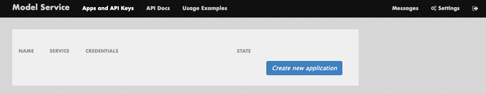

# Access & Usage Information

## Basic Information

### Model Server URL

The model server can be accessed [here](https://model-service.apps.rosa.redhat-ai-dev.m6no.p3.openshiftapps.com/).

## Authentication

In order to gain access to the model server you will need to sign in with your SSO credentials. Once you have signed in you are able to generate a token by navigating to **`Apps and API Keys`** on the top ribbon and hitting **`Create new Application`**:



**Note:** If you are unable to access the model server via SSO you need to reach out to a platform administrator.

## API Schema
<!--
The name of the api, model-service-api, is grabbed from the name field in the ai-catalog.yaml metadata for the api.
-->
The API Schema is available [here](../../../../../api/model-service-api/definition).

## Usage Examples
<!--
Sourced from: https://model-service.apps.rosa.redhat-ai-dev.m6no.p3.openshiftapps.com/examples
-->

### IBM Granite-8B-Code-Instruct

#### Text Generation

##### Using Curl

```
curl -X 'POST' \
    'https://ibm-granite-8b-code-instruct-3scale-apicast-production.<hostname>:<port>/v1/completions' \
    -H 'accept: application/json' \
    -H 'Content-Type: application/json' \
    -H 'Authorization: Bearer ***************************' \
    -d '{
    "model": "ibm-granite-8b-code-instruct",
    "prompt": "San Francisco is a",
    "max_tokens": 15,
    "temperature": 0
}'
```

##### Python

```python
import requests
import urllib3
import numpy as np
import json

API_URL = "https://ibm-granite-8b-code-instruct-3scale-apicast-production.<hostname>:<port>"
API_KEY = "***************************"

input = ["San Francisco is a"]

completion = requests.post(
    url=API_URL+'/v1/completions',
    json={
      "model": "ibm-granite-8b-code-instruct",
      "prompt": "San Francisco is a",
      "max_tokens": 15,
      "temperature": 0
    },
    headers={'Authorization': 'Bearer '+API_KEY}
).json()

print(completion)
```

##### Python With Langchain

**Note:** Requires `pip install langchain-community`

```python
from langchain_community.llms import VLLMOpenAI

API_URL = "https://ibm-granite-8b-code-instruct-3scale-apicast-production.<hostname>:<port>"
API_KEY = "***************************"

llm = VLLMOpenAI(
    openai_api_key=API_KEY,
    openai_api_base=API_URL+"/v1",
    model_name="ibm-granite-8b-code-instruct",
    model_kwargs={"stop": ["."]},
)
print(llm.invoke("Rome is"))
```


##### Connecting Continue.dev to Granite-Code-Instruct

```
...
"models": [
    {
      "title": "Granite-8B-Instruct",
      "provider": "openai",
      "model": "ibm-granite-8b-code-instruct",
      "apiBase": "https://ibm-granite-8b-code-instruct-3scale-apicast-production.<hostname>:<port>/v1/",
      "apiKey": "************************",
      "completionOptions": {
      "temperature": 0.1,
      "topK": 1,
      "topP": 1,
      "presencePenalty": 0,
      "frequencyPenalty": 0
      }
    }
...
"tabAutocompleteModel": {
    "title": "Granite-8B-Instruct",
    "provider": "openai",
    "model": "ibm-granite-8b-code-instruct",
    "apiBase": "https://ibm-granite-8b-code-instruct-3scale-apicast-production.<hostname>:<port>/v1/",
    "apiKey": "****************************",
    "completionOptions": {
      "temperature": 0.1,
      "topK": 1,
      "topP": 1,
      "presencePenalty": 0,
      "frequencyPenalty": 0
    }
  },
  "tabAutocompleteOptions": {
    "useCopyBuffer": false,
    "maxPromptTokens": 1024,
    "prefixPercentage": 0.5
  },
...
```


#### Embeddings (Nomic-Embed-Text)

##### Using Curl

```
curl -X 'POST' \
  'https://nomic-embed-text-v1-5-maas-apicast-production.<hostname>:<port>/embed' \
  -H 'accept: application/json' \
  -H 'Content-Type: application/json' \
  -H 'Authorization: Bearer *************************' \
  -d '{
  "inputs": "string",
  "normalize": true,
  "truncate": false,
  "truncation_direction": "Right"
}' 
```

##### Python

```python
# Calling the base embeddings API

import requests
import urllib3
import numpy as np
import json

API_URL = "https://nomic-embed-text-v1-5-maas-apicast-production.<hostname>:<port>"
API_KEY = "*************************"

test_strings = ["That is a happy dog","That is a very happy person","Today is a sunny day"]

embeddings = requests.post(
    url=API_URL+'/embed',
    json={"inputs": test_strings},
    headers={'Authorization': 'Bearer '+API_KEY}
).json()

print(embeddings)
```

```python
# Calling the OpenAI-compatible embeddings API

import requests
import urllib3
import numpy as np
import json

API_URL = "https://nomic-embed-text-v1-5-maas-apicast-production.<hostname>:<port>"
API_KEY = "*************************"

test_strings = ["That is a happy dog","That is a very happy person","Today is a sunny day"]

embeddings = requests.post(
    url=API_URL+'/v1/embeddings',
    json={"input": test_strings},
    headers={'Authorization': 'Bearer '+API_KEY}
).json()

print(embeddings)
```

##### Python With Langchain

**Note:** Requires `pip install langchain-community`

```python
from langchain_openai import OpenAIEmbeddings

API_URL = "https://nomic-embed-text-v1-5-maas-apicast-production.<hostname>:<port>"
API_KEY = "*************************"

embeddings_model = OpenAIEmbeddings(openai_api_base=API_URL, openai_api_key=API_KEY)

test_strings = ["That is a happy dog","That is a very happy person","Today is a sunny day"]

embeddings = embeddings_model.embed_documents(test_strings)

print(embeddings)
```

### Meta Llama-3.1-8B-Instruct
<!--
Since Llama is not actually deployed this is dummy data for an example
-->

#### Text Generation

##### Using Curl

```
curl -X 'POST' \
    'https://meta-llama-31-8b-instruct-3scale-apicast-production.<hostname>:<port>/v1/completions' \
    -H 'accept: application/json' \
    -H 'Content-Type: application/json' \
    -H 'Authorization: Bearer ***************************' \
    -d '{
    "model": "meta-llama-31-8b-instruct",
    "prompt": "San Francisco is a",
    "max_tokens": 15,
    "temperature": 0
}'
```

##### Python

```python
import requests
import urllib3
import numpy as np
import json

API_URL = "https://meta-llama-31-8b-instruct-3scale-apicast-production.<hostname>:<port>"
API_KEY = "***************************"

input = ["San Francisco is a"]

completion = requests.post(
    url=API_URL+'/v1/completions',
    json={
      "model": "meta-llama-31-8b-instruct",
      "prompt": "San Francisco is a",
      "max_tokens": 15,
      "temperature": 0
    },
    headers={'Authorization': 'Bearer '+API_KEY}
).json()

print(completion)
```