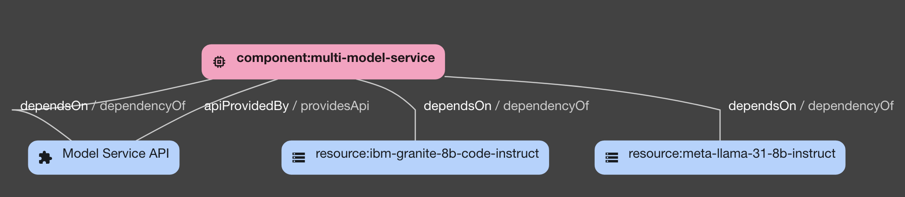

# RHDH Model Catalog

Reference implementation of an AI model catalog in RHDH.

## Description

This repository contains two examples, based on real model servers that have been deployed:

1) [developer-model-service](./developer-model-service/):

   - A vllm-based single model service running IBM's granite-8b-code-instruct model, with 3scale acting as an API gateway

2) [ollama-model-service](./ollama-model-service/)
 
   - An ollama-based multi model service running a variety of LLMs. 

Each example has Backstage `catalog-info.yaml` file provided with it, that represents the model server and model(s) as Backstage catalog types for import into RHDH. Each catalog has corresponding techdocs with it, that provide documentation for the model server and model(s). 

For more information on the structure of the model catalog, see below

## Catalog Structure

In this catalog: 
- Each model server is represented as a `Component` with type `model-server`, containing information such as:
   - Name, description URL, authentication status, and how to get access
- Each model deployed on a model server is represented as a `Resource` with type `ai-model`, containing information such as:
   - Name, description, model usage, intended tasks, tags, license, and author
- An `API` object representing the model server API type (e.g. OpenAI, OpenVINO, etc)
- Each `model-server` Component `dependsOn`:
   - The 1 to N `ai-model` resources deployed on it
   - The `API` object associated with the model server

### Model Metadata

The following metadata is stored for each model in the catalog: 

| Name         | Type     | Description | Catalog Implementation |
| ------------ | -------- | ------------| ---------------------- |
| Name         | String     | The name of the model. | Resource [metadata.name](https://github.com/redhat-ai-dev/model-catalog-example/blob/main/developer-model-service/catalog-info.yaml#L49) |
| Tasks        | String[]   | The intended tasks for the model. | Resource [metadata.tags[]](https://github.com/redhat-ai-dev/model-catalog-example/blob/main/developer-model-service/catalog-info.yaml#L80). Can prefix task specific tags to highlight e.g. `task-text-generation`, or `task#text-generation`. |
| Usage        | String     | Brief description on the usage for the model. | Resource [metadata.description](https://github.com/redhat-ai-dev/model-catalog-example/blob/main/developer-model-service/catalog-info.yaml#L52) |
| Type         | String     | The type of model being stored in the catalog. | Resource [techdoc](https://github.com/redhat-ai-dev/model-catalog-example/blob/main/developer-model-service/ibm-granite-8b-code-instruct/docs/model.md) or [tags](https://github.com/redhat-ai-dev/model-catalog-example/blob/main/developer-model-service/catalog-info.yaml#L77) |
| License      | URL        | The license that the model uses. | Resource [metadata.links[]](https://github.com/redhat-ai-dev/model-catalog-example/blob/main/developer-model-service/catalog-info.yaml#L70-L73) or [techdoc](https://github.com/redhat-ai-dev/model-catalog-example/blob/main/developer-model-service/ibm-granite-8b-code-instruct/docs/license.md) |
| Tags         | String[]   | Descriptive labels for the model to aid in filtering. | Resource [metadata.tags[]](https://github.com/redhat-ai-dev/model-catalog-example/blob/4226b2216c1767d50429f239ec9e8406f2f08d86/developer-model-service/catalog-info.yaml#L74-L80) |
| Author       | String     | The author of the model. | Resource [metadata.tags[]](https://github.com/redhat-ai-dev/model-catalog-example/blob/4226b2216c1767d50429f239ec9e8406f2f08d86/developer-model-service/catalog-info.yaml#L76) |
| Maintainer   | String     | The maintainer of the model deployed on the model server. | Resource [spec.owner](https://github.com/redhat-ai-dev/model-catalog-example/blob/main/developer-model-service/catalog-info.yaml#L83) |
| Instructions | Techdoc    | Instructions on how to access / use the model. | Component [techdocs](https://github.com/redhat-ai-dev/model-catalog-example/blob/main/developer-model-service/docs/access.md) |
| Download Link | URL         | A link to download the model's files (e.g. GGUF artifacts). | Resource [metadata.links[]](https://github.com/redhat-ai-dev/model-catalog-example/blob/main/developer-model-service/catalog-info.yaml#L62-L69) |

### Model Server Metadata

The following metadata is stored for each model server in the catalog: 

| Name                             | Type        | Description                                      | Catalog Implementation |
| -------------------------------- | ----------- | -------------------------------------------------| ---------------------- |
| Model Server Type                | String      | The type of model server API that the model uses. | [API](https://github.com/redhat-ai-dev/model-catalog-example/blob/4226b2216c1767d50429f239ec9e8406f2f08d86/developer-model-service/catalog-info.yaml#L92-L2036) |
| Authentication Required?         | Boolean     | Authentication status for the server.             | Component [techdocs](https://github.com/redhat-ai-dev/model-catalog-example/blob/main/developer-model-service/docs/access.md) |
| API Link                         | URL         | A link corresponding to the API endpoint for the model service that has the model deployed. | Component [metadata.links[]](https://github.com/redhat-ai-dev/model-catalog-example/blob/4226b2216c1767d50429f239ec9e8406f2f08d86/developer-model-service/catalog-info.yaml#L18-L21) |
| Access Link                         | URL         | A link to access the model if hosted online. | Component [metadata.links[]](https://github.com/redhat-ai-dev/model-catalog-example/blob/4226b2216c1767d50429f239ec9e8406f2f08d86/developer-model-service/catalog-info.yaml#L14-L17) |
| API Schema              | String          | The API schema for the model server. | API [spec.definition](https://github.com/redhat-ai-dev/model-catalog-example/blob/4226b2216c1767d50429f239ec9e8406f2f08d86/developer-model-service/catalog-info.yaml#L113-L2036) |
| Access Instructions     | Techdoc        | How to get access to and how to use the model server. | Component [techdoc](https://github.com/redhat-ai-dev/model-catalog-example/blob/main/developer-model-service/docs/access.md) |

