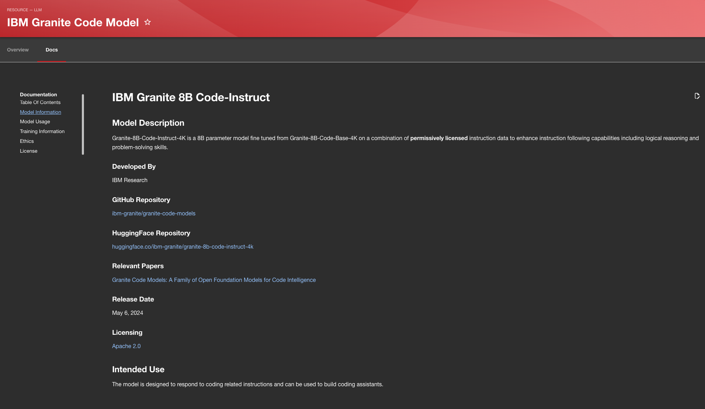
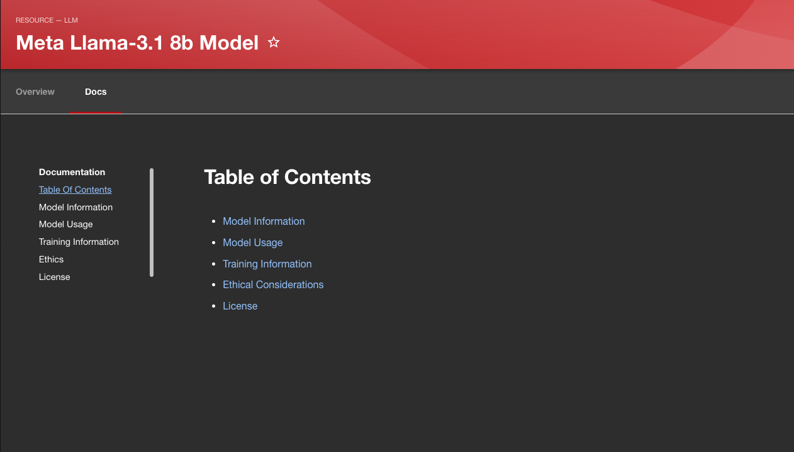
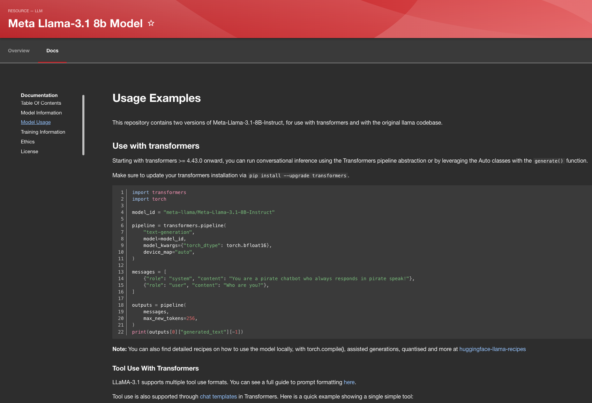

# AI Catalog Model Tech Doc Guide

This guide can be used as a reference point when trying to add/customize your own documentation for individual models.

## Template

- [index.md](#model-information---indexmd)
- [code/usage-examples.md](#model-usage---codeusage-examplesmd)
- [training.md](#training-information---trainingmd)
- [ethics.md](#ethical-considerations---ethicsmd)
- [license.md](#license---licensemd)

### Model Information - index.md

#### Model Description

This section should contain a brief description/introduction of the model. Pretty much every model will have something along the lines of this provided. Additionally, you should aim to provide the following information as part of this document:

1. Developed By
2. Code Repository
   1. GitHub/GitLab if provided
3. Model Repository
   1. Link to the repository page of the model (i.e. HuggingFace)
4. Relevant Papers (if provided)
5. Release Date (if provided)
6. Licensing
   1. Link to the license (i.e. link to the Apache 2 website)

#### Intended Use

This section should contain the intended use of the model. Most suppliers of the models will have a section like this on the repository page for the model. 

### Model Usage - code/usage-examples.md

This document should aim to provide users with the information required to consume the model. For example, if the model has a Python package that can be imported then it would be important to provide examples of different actions you can perform.

You are able to format Markdown to properly highlight code based on language by adding the language next to your 3 back-ticks.

Example: 
````
```python
<code block>
```
````

### Training Information - training.md

This training section should preferably contain information such as:

- The infrastructure the model was trained on
- Data the model was trained on
- Performance data if supplied

During research it was found that a good deal of models that provided performance/benchmarking data did so for the entire model suite (all sizes), in order to provide relevant information it may be necessary to trim the data to only provide information for the model the Tech Doc is for.

Some models may also come supplied with information about the environmental costs of training this model, if that is supplied it would also be valid to add as part of this section.


### Ethical Considerations - ethics.md

This is an optional section that should be added if the model provider has this as part of their documentation. From my findings a majority of large companies/model providers have included this section in their model repositories/descriptions. 

### License - license.md

This section contains the license the model falls under as part of a Markdown file. This allows it to be easily referenced through the Tech Doc instead of needing to follow and external link for viewing.

## Creating Tech Docs

- [Directory Format & Best Practices](#directory-format--best-practices)
- [Creating mkdocs.yaml](#creating-mkdocsyaml)
- [Adding Docs To The Catalog](#adding-docs-to-the-catalog)

### Directory Format & Best Practices

When looking to add Tech Docs to your resource there are a few practices you should adhere to; this will help ensure that everything is rendered correctly:

- All documentation should be under `/docs` with image assets such as PNGs being stored under `/docs/images` and Markdown files containing code samples under `/docs/code`


### Creating mkdocs.yaml

- All Markdown files should be referenced within mkdocs.yaml, for file path you should reference the .md files as if mkdocs.yaml is the root:

```yaml
site_name: 'Documentation'

nav:
  - Model Information: index.md
  - Model Usage: code/usage-examples.md
  - Training Information: training.md
  - Ethics: ethics.md
  - License: license.md
```

### Adding Docs To The Catalog

In order to add your resource (along with the documentation) to your Catalog you will need to add them to your `<catalog-name>.yaml` file. Reference this is the [Red Hat AI Catalog](https://github.com/redhat-ai-dev/model-catalog-example/blob/main/developer-model-service/mkdocs.yml).

For your Tech Docs to properly render and be referenced, you will need to add [the following annotation](https://github.com/redhat-ai-dev/model-catalog-example/blob/main/developer-model-service/catalog-info.yaml#L51) to your catalog entry.

```
metadata:
    name: <resource-name>
    annotations:
        backstage.io/techdocs-ref: dir:<path-to-resource>
```

## Examples

### Existing Work

You are able to view the differing templates/structures in action as part of [developer-model-service](https://github.com/redhat-ai-dev/model-catalog-example/tree/main/developer-model-service) and [ollama-model-service](https://github.com/redhat-ai-dev/model-catalog-example/tree/main/ollama-model-service).


### Screenshots





