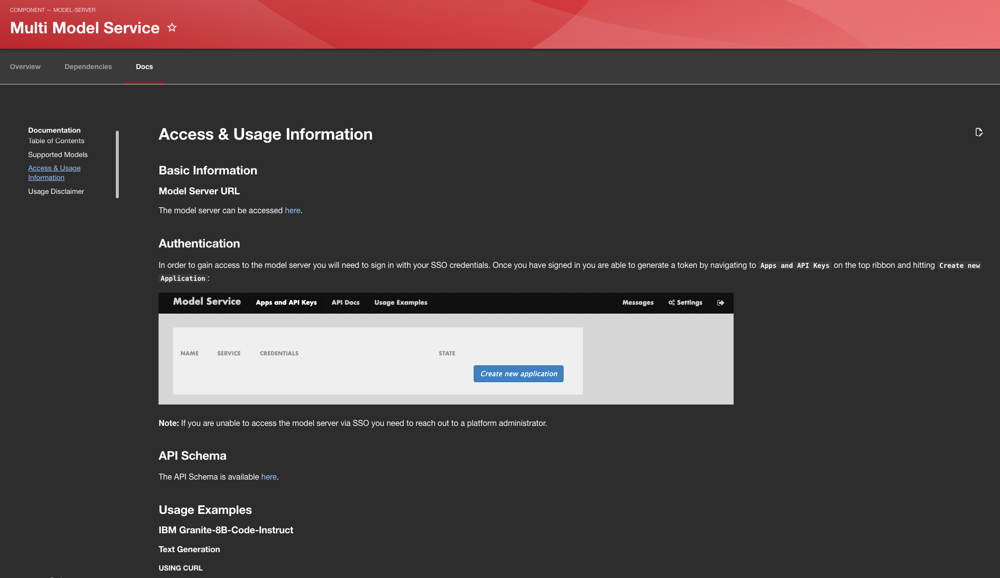
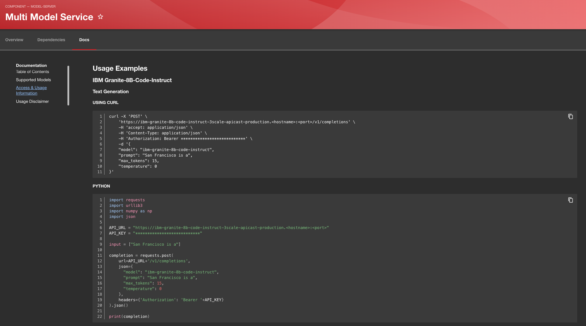

# AI Catalog Model Server Tech Doc Guide

This guide can be used as a reference point when trying to add/customize your own documentation for a model server.

## Template

- [models.md](#supported-models---indexmd)
- [code/access.md](#access--usage-information---codeaccessmd)
- [usage.md](#usage-disclaimer---usagemd)

### Supported Models - index.md

This document is intended to consolidate all of the supported models that are accessible via this model server. This allows users to easily view the model information (such as Hugging Face link) and the documentation (tech docs link) for each model they have the option to use. By linking to the deployed models resource Tech Docs we are able to reuse the documentation and utilize the full power of the Tech Docs.

### Access & Usage Information - code/access.md

This document should aim to provide users with the information required to consume the models through the model server. This would contain basic setup information such as how to access the server as well as getting yourself authenticated. Additionally, it would be beneficial to contain examples of how you can utilize the model server endpoint to query the models. Remember to keep API keys out of your documentation if possible.

This document would ideally contain a separate section for each supported model to ensure that any differences in usage across models is accounted for.

You are able to format Markdown to properly highlight code based on language by adding the language next to your 3 back-ticks.

Example: 
````
```python
<code block>
```
````

### Usage Disclaimer - usage.md

This section is important for the users of the model server (and models) to have the information necessary to make smart decisions while consuming these services. This is a good section for outlining any legal disclaimers or notices you wish to attach to the services. 

As an example, if you do not want users generating open source or production software with the models you should add a snippet about that to this document.


## Creating Tech Docs

- [Directory Format & Best Practices](#directory-format--best-practices)
- [Creating mkdocs.yaml](#creating-mkdocsyaml)
- [Adding Docs To The Catalog](#adding-docs-to-the-catalog)

### Directory Format & Best Practices

When looking to add Tech Docs to your resource there are a few practices you should adhere to; this will help ensure that everything is rendered correctly:

- All documentation should be under `/docs` with image assets such as PNGs being stored under `/docs/images` and Markdown files containing code samples under `/docs/code`


### Creating mkdocs.yaml

- All Markdown files should be referenced within mkdocs.yaml, for file path you should reference the .md files as if mkdocs.yaml is the root:

```yaml
site_name: 'Documentation'

nav:
  - Model Information: index.md
  - Model Usage: code/usage-examples.md
  - Training Information: training.md
  - Ethics: ethics.md
  - License: license.md
```

### Adding Docs To The Catalog

In order to add your resource (along with the documentation) to your Catalog you will need to add them to your `<catalog-name>.yaml` file. Reference this is the [Red Hat AI Catalog](https://github.com/redhat-ai-dev/model-catalog-example/blob/main/developer-model-service/mkdocs.yml).

For your Tech Docs to properly render and be referenced, you will need to add [the following annotation](https://github.com/redhat-ai-dev/model-catalog-example/blob/main/developer-model-service/catalog-info.yaml#L51) to your catalog entry.

```
metadata:
    name: <resource-name>
    annotations:
        backstage.io/techdocs-ref: dir:<path-to-resource>
```

## Examples

### Existing Work

You are able to view the differing templates/structures in action as part of [developer-model-service](https://github.com/redhat-ai-dev/model-catalog-example/tree/main/developer-model-service) and [ollama-model-service](https://github.com/redhat-ai-dev/model-catalog-example/tree/main/ollama-model-service).


### Screenshots




